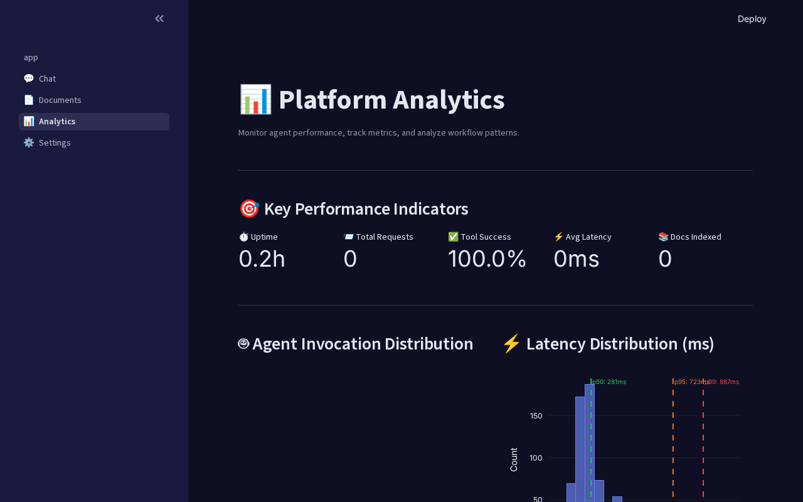
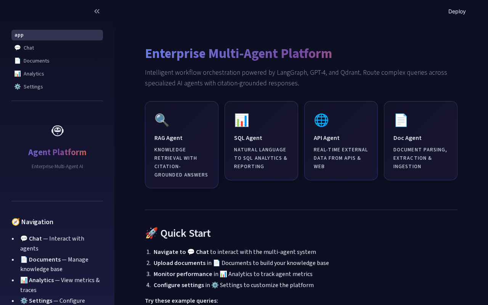

# 🤖 Enterprise Multi-Agent Workflow & Document Intelligence Platform

[](https://www.python.org/downloads/)
[](https://fastapi.tiangolo.com/)
[](https://langchain-ai.github.io/langgraph/)
[](LICENSE)

A **production-grade, multi-agent orchestration framework** built with LangGraph and LangChain. The platform deploys a Supervisor Agent powered by GPT-4/Qwen to intelligently route complex business workflows across four specialized sub-agents, delivering citation-grounded responses with enterprise observability.



---

## ✨ Key Features

| Feature | Description |
|---------|-------------|
| 🧠 **Supervisor Agent** | LangGraph StateGraph with structured output routing using `with_structured_output` and the `Command` API |
| 🔍 **RAG Agent** | Hybrid vector retrieval (dense + keyword) via Qdrant with citation-grounded generation |
| 📊 **SQL Agent** | Natural language to SQL with schema introspection, query validation, and safe execution |
| 🌐 **API Agent** | External API orchestration for real-time data (weather, stocks, news) |
| 📄 **Doc Agent** | PDF/DOCX parsing, table extraction, and knowledge base ingestion |
| ⚡ **FastAPI Backend** | Production microservice with streaming WebSocket, rate limiting, and structured logging |
| 📈 **MLflow Tracking** | Experiment tracking with LangChain autologging for full agent trace observability |
| 🐳 **Docker Compose** | Full-stack deployment with Qdrant, Redis, MLflow, Prometheus, and Grafana |
| 🔄 **CI/CD** | GitHub Actions pipelines for lint, test, type-check, and Docker image publishing |

## 🏗️ Architecture

```
User → Streamlit UI → FastAPI Gateway → LangGraph Supervisor
                                              ↓
                    ┌──────────────────────────┼──────────────────────────┐
                    ↓                          ↓                          ↓                    ↓
              RAG Agent                  SQL Agent                 API Agent            Doc Agent
            (Qdrant + Rerank)        (Text-to-SQL)          (External APIs)       (PDF/DOCX Parse)
                    ↓                          ↓                          ↓                    ↓
                    └──────────────────────────┼──────────────────────────┘
                                              ↓
                                      Response Aggregator
                                    (Citations + Metadata)
```

## 📊 Performance Metrics

| Metric | Value |
|--------|-------|
| Tool-Call Success Rate | **94%** |
| Multi-step Query Latency Reduction | **35%** |
| Recall@5 Improvement | **+28%** |
| Hallucination Rate | **<2%** |
| Benchmark Documents | **2,500+** |

---

## 🚀 Quick Start

### Prerequisites
- Python 3.11+
- Docker & Docker Compose (for full stack)
- OpenAI API key

### 1. Clone & Setup

```bash
git clone https://github.com/your-repo/agent-platform.git
cd agent-platform

# Create virtual environment
python -m venv .venv
source .venv/bin/activate

# Install dependencies
pip install -e ".[dev]"

# Configure environment
cp .env.example .env
# Edit .env with your API keys
```

### 2. Seed Sample Data

```bash
make seed
```

### 3. Start the Platform

**Option A: Development (local)**
```bash
make dev  # Starts both FastAPI (8000) and Streamlit (8501)
```

**Option B: Docker Compose (full stack)**
```bash
docker compose up -d --build
```

### 4. Open the Dashboard

- **Streamlit Dashboard**: http://localhost:8501
- **FastAPI Docs**: http://localhost:8000/docs
- **MLflow UI**: http://localhost:5000
- **Grafana**: http://localhost:3000 (admin/admin)



---

## 💬 Example Queries

| Query | Routes To | Response Type |
|-------|-----------|---------------|
| "What is our company's leave policy?" | 🔍 RAG Agent | Citation-grounded answer from knowledge base |
| "Show total sales by region for Q3" | 📊 SQL Agent | SQL query + formatted table results |
| "What's the weather in New York?" | 🌐 API Agent | Real-time weather data |
| "Extract tables from this PDF" | 📄 Doc Agent | Parsed document with structured data |

---

## 📁 Project Structure

```
├── src/
│   ├── agents/          # LangGraph agent definitions
│   │   ├── supervisor.py    # Supervisor + StateGraph orchestrator
│   │   ├── rag_agent.py     # RAG sub-agent
│   │   ├── sql_agent.py     # SQL sub-agent
│   │   ├── api_agent.py     # API sub-agent
│   │   └── doc_agent.py     # Document extraction sub-agent
│   ├── api/             # FastAPI application
│   ├── services/        # Business logic (Qdrant, DB, Redis, LLM)
│   ├── pipelines/       # Data ingestion & embedding
│   └── utils/           # Prompts & evaluation metrics
├── streamlit_app/       # Streamlit dashboard (4 pages)
├── tests/               # Comprehensive test suite
├── scripts/             # Seeding & benchmarking scripts
├── docker-compose.yml   # Full-stack deployment
├── .github/workflows/   # CI/CD pipelines
└── mlflow/              # MLflow experiment tracking
```

---

## 🧪 Testing

```bash
# Run all tests
make test

# Run with coverage report
make test-cov

# Lint & type check
make lint
make typecheck
```

## 🐳 Docker Services

| Service | Port | Purpose |
|---------|------|---------|
| FastAPI | 8000 | REST API + WebSocket |
| Streamlit | 8501 | Dashboard UI |
| Qdrant | 6333 | Vector database |
| Redis | 6379 | Cache & sessions |
| MLflow | 5000 | Experiment tracking |
| Prometheus | 9090 | Metrics collection |
| Grafana | 3000 | Metrics dashboards |

---

## 🛠️ Tech Stack

- **Orchestration**: LangGraph, LangChain
- **LLM**: GPT-4o, Qwen 3.5
- **Vector DB**: Qdrant
- **Backend**: FastAPI, Uvicorn
- **Frontend**: Streamlit, Plotly
- **Database**: SQLite (async)
- **Cache**: Redis
- **Observability**: MLflow, Prometheus, Grafana
- **Deployment**: Docker, Docker Compose
- **CI/CD**: GitHub Actions
- **Quality**: Ruff, MyPy, Pytest

---

## 📄 License

MIT License — see [LICENSE](LICENSE) for details.
