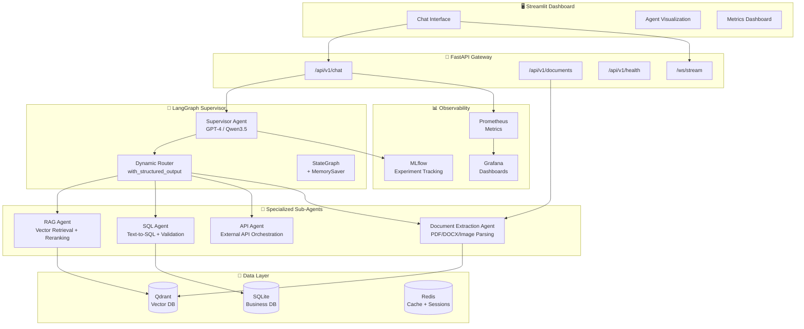

# Enterprise Multi-Agent Workflow & Document Intelligence Platform

Build a production-grade, enterprise multi-agent orchestration platform that demonstrates mastery of LLM engineering, RAG pipelines, agentic AI, microservices, and MLOps — all in one cohesive codebase.

## Architecture Overview



---

## Project Structure

```
Agent/
├── README.md
├── pyproject.toml
├── .env.example
├── Makefile
├── docker-compose.yml
├── Dockerfile
│
├── src/
│   ├── __init__.py
│   ├── config.py                    # Centralized configuration (Pydantic Settings)
│   │
│   ├── agents/                      # All LangGraph agent logic
│   │   ├── __init__.py
│   │   ├── supervisor.py            # Supervisor agent + LangGraph StateGraph
│   │   ├── state.py                 # Shared state definitions
│   │   ├── rag_agent.py             # RAG sub-agent (retrieval + generation)
│   │   ├── sql_agent.py             # SQL sub-agent (text-to-SQL)
│   │   ├── api_agent.py             # API sub-agent (external API calls)
│   │   └── doc_agent.py             # Document extraction sub-agent
│   │
│   ├── tools/                       # Tool definitions for agents
│   │   ├── __init__.py
│   │   ├── rag_tools.py             # Vector search, hybrid search, reranking
│   │   ├── sql_tools.py             # SQL execution, schema introspection
│   │   ├── api_tools.py             # HTTP client, API wrappers
│   │   └── doc_tools.py             # PDF/DOCX/image parsing tools
│   │
│   ├── pipelines/                   # Data ingestion and processing
│   │   ├── __init__.py
│   │   ├── ingestion.py             # Document ingestion pipeline
│   │   ├── chunking.py              # Semantic chunking strategies
│   │   └── embedding.py             # Embedding generation + caching
│   │
│   ├── api/                         # FastAPI application
│   │   ├── __init__.py
│   │   ├── main.py                  # FastAPI app factory
│   │   ├── routes/
│   │   │   ├── __init__.py
│   │   │   ├── chat.py              # Chat endpoint (sync + streaming)
│   │   │   ├── documents.py         # Document upload/management
│   │   │   ├── health.py            # Health + readiness checks
│   │   │   └── metrics.py           # Metrics export endpoint
│   │   ├── middleware/
│   │   │   ├── __init__.py
│   │   │   ├── logging.py           # Structured request logging
│   │   │   └── rate_limit.py        # Rate limiting middleware
│   │   └── dependencies.py          # Dependency injection
│   │
│   ├── services/                    # Business logic layer
│   │   ├── __init__.py
│   │   ├── vector_store.py          # Qdrant client wrapper
│   │   ├── database.py              # SQLite/async DB service
│   │   ├── cache.py                 # Redis cache service
│   │   └── llm_provider.py          # LLM provider abstraction (OpenAI/Qwen)
│   │
│   └── utils/
│       ├── __init__.py
│       ├── prompts.py               # Prompt templates
│       └── evaluation.py            # RAG evaluation metrics
│
├── streamlit_app/                   # Streamlit frontend
│   ├── app.py                       # Main Streamlit entry point
│   ├── pages/
│   │   ├── 1_💬_Chat.py             # Chat interface
│   │   ├── 2_📄_Documents.py        # Document management
│   │   ├── 3_📊_Analytics.py        # Metrics + agent traces
│   │   └── 4_⚙️_Settings.py         # Configuration panel
│   └── components/
│       ├── agent_trace.py           # Agent execution visualization
│       └── metrics_cards.py         # KPI metric cards
│
├── data/                            # Sample data for demos
│   ├── sample_docs/
│   └── sample_db.sql
│
├── tests/                           # Test suite
│   ├── __init__.py
│   ├── conftest.py
│   ├── test_agents/
│   ├── test_api/
│   ├── test_pipelines/
│   └── test_tools/
│
├── scripts/                         # Utility scripts
│   ├── seed_data.py                 # Seed Qdrant + SQLite with sample data
│   └── benchmark.py                 # Run benchmarks and generate reports
│
├── mlflow/                          # MLflow configuration
│   └── mlflow_config.py
│
└── .github/
    └── workflows/
        ├── ci.yml                   # Lint, test, type-check
        └── cd.yml                   # Build + push Docker image
```

---

## Proposed Changes

### 1. Core Configuration & Project Setup

#### [NEW] [pyproject.toml](file:///home/wot-raj/Projects/Agent/pyproject.toml)
- Python project config with all dependencies: `langgraph`, `langchain`, `langchain-openai`, `langchain-community`, `fastapi`, `uvicorn`, `qdrant-client`, `redis`, `mlflow-tracing`, `streamlit`, `pydantic-settings`, `python-multipart`, `pypdf`, `python-docx`, `unstructured`, `httpx`, `pytest`, etc.
- Dev dependencies: `ruff`, `mypy`, `pytest-asyncio`, `pytest-cov`

#### [NEW] [.env.example](file:///home/wot-raj/Projects/Agent/.env.example)
- Template for all environment variables: `OPENAI_API_KEY`, `QDRANT_URL`, `REDIS_URL`, `MLFLOW_TRACKING_URI`, `LLM_MODEL`, etc.

#### [NEW] [src/config.py](file:///home/wot-raj/Projects/Agent/src/config.py)
- Pydantic `BaseSettings` class loading from `.env`
- Centralized config for all services (LLM provider, vector store, database, cache, MLflow)

---

### 2. LangGraph Multi-Agent Orchestration (Core)

#### [NEW] [src/agents/state.py](file:///home/wot-raj/Projects/Agent/src/agents/state.py)
- `AgentState(TypedDict)` with: `messages`, `next_agent`, `context`, `tool_results`, `metadata`, `citations`
- Router schema using Pydantic `BaseModel` with `Literal` typing for structured output

#### [NEW] [src/agents/supervisor.py](file:///home/wot-raj/Projects/Agent/src/agents/supervisor.py)
- **Supervisor Agent** using `StateGraph` from LangGraph
- Uses `with_structured_output` for deterministic routing to sub-agents
- Implements the `Command` API for dynamic routing (LangGraph 0.3+ pattern)
- `MemorySaver` checkpointer for stateful conversations
- System prompt with detailed routing instructions for each sub-agent
- Aggregates results from sub-agents and formats final response with citations
- MLflow autologging integration: `mlflow.langchain.autolog()`

#### [NEW] [src/agents/rag_agent.py](file:///home/wot-raj/Projects/Agent/src/agents/rag_agent.py)
- `create_react_agent` with RAG-specific tools
- Hybrid search (dense + sparse/keyword) via Qdrant
- Query transformation (rewriting user queries for better retrieval)
- Reranking step for top-K results
- Citation-grounded generation (returns source doc references)
- Hallucination guard: validates response against retrieved context

#### [NEW] [src/agents/sql_agent.py](file:///home/wot-raj/Projects/Agent/src/agents/sql_agent.py)
- Text-to-SQL generation with schema introspection
- SQL validation and sanitization (prevent injection)
- Query execution with result formatting
- Schema-aware prompt construction
- Error recovery: retries with corrected SQL on execution failures

#### [NEW] [src/agents/api_agent.py](file:///home/wot-raj/Projects/Agent/src/agents/api_agent.py)
- External API orchestration agent
- Tools for making HTTP requests (GET/POST) to configured endpoints
- Response parsing and formatting
- Rate limiting and retry logic
- Mock API endpoints for demo (weather, stock, news)

#### [NEW] [src/agents/doc_agent.py](file:///home/wot-raj/Projects/Agent/src/agents/doc_agent.py)
- Document extraction and processing agent
- PDF parsing (pypdf), DOCX parsing (python-docx)
- Table extraction from documents
- Key-value pair extraction using LLM
- Triggers ingestion pipeline to add extracted content to Qdrant

---

### 3. Tool Definitions

#### [NEW] [src/tools/rag_tools.py](file:///home/wot-raj/Projects/Agent/src/tools/rag_tools.py)
- `@tool` decorated functions: `vector_search`, `hybrid_search`, `rerank_results`
- Qdrant collection querying with metadata filtering
- BM25 sparse vector search for keyword matching

#### [NEW] [src/tools/sql_tools.py](file:///home/wot-raj/Projects/Agent/src/tools/sql_tools.py)
- `@tool` functions: `execute_sql`, `get_schema`, `list_tables`, `validate_sql`
- Safe SQL execution with parameterized queries
- Schema introspection tool for the LLM

#### [NEW] [src/tools/api_tools.py](file:///home/wot-raj/Projects/Agent/src/tools/api_tools.py)
- `@tool` functions: `http_get`, `http_post`, `search_web_api`
- Configurable API endpoint registry
- Response parsing (JSON, XML)

#### [NEW] [src/tools/doc_tools.py](file:///home/wot-raj/Projects/Agent/src/tools/doc_tools.py)
- `@tool` functions: `parse_pdf`, `parse_docx`, `extract_tables`, `extract_key_values`
- Document processing utilities

---

### 4. Data Ingestion Pipeline

#### [NEW] [src/pipelines/ingestion.py](file:///home/wot-raj/Projects/Agent/src/pipelines/ingestion.py)
- End-to-end document ingestion: parse → chunk → embed → store
- Supports PDF, DOCX, TXT, MD formats
- Idempotent ingestion with deterministic chunk IDs
- Progress tracking and error handling

#### [NEW] [src/pipelines/chunking.py](file:///home/wot-raj/Projects/Agent/src/pipelines/chunking.py)
- Semantic chunking using `RecursiveCharacterTextSplitter`
- Configurable chunk size and overlap
- Metadata preservation (source file, page number, section)

#### [NEW] [src/pipelines/embedding.py](file:///home/wot-raj/Projects/Agent/src/pipelines/embedding.py)
- Embedding generation with OpenAI or local models
- Batch processing for efficiency
- Embedding cache to avoid redundant API calls

---

### 5. FastAPI Microservice

#### [NEW] [src/api/main.py](file:///home/wot-raj/Projects/Agent/src/api/main.py)
- FastAPI app factory with CORS, middleware, and lifespan events
- Mounts all route modules
- Prometheus metrics middleware integration
- Structured JSON logging

#### [NEW] [src/api/routes/chat.py](file:///home/wot-raj/Projects/Agent/src/api/routes/chat.py)
- `POST /api/v1/chat` — synchronous chat endpoint
- `WebSocket /ws/stream` — real-time streaming endpoint
- Request/response models with Pydantic
- Invokes the LangGraph Supervisor

#### [NEW] [src/api/routes/documents.py](file:///home/wot-raj/Projects/Agent/src/api/routes/documents.py)
- `POST /api/v1/documents/upload` — file upload + ingestion
- `GET /api/v1/documents` — list ingested documents
- `DELETE /api/v1/documents/{doc_id}` — remove document + vectors

#### [NEW] [src/api/routes/health.py](file:///home/wot-raj/Projects/Agent/src/api/routes/health.py)
- `GET /api/v1/health` — liveness probe
- `GET /api/v1/ready` — readiness probe (checks Qdrant, Redis, DB)

#### [NEW] [src/api/routes/metrics.py](file:///home/wot-raj/Projects/Agent/src/api/routes/metrics.py)
- `GET /api/v1/metrics` — Prometheus-compatible metrics export
- Agent invocation counts, latency histograms, tool-call success rates

#### [NEW] [src/api/middleware/](file:///home/wot-raj/Projects/Agent/src/api/middleware/)
- Structured request/response logging middleware
- Rate limiting middleware (token bucket)

#### [NEW] [src/api/dependencies.py](file:///home/wot-raj/Projects/Agent/src/api/dependencies.py)
- FastAPI dependency injection for Qdrant client, DB session, Redis, LLM provider

---

### 6. Service Layer

#### [NEW] [src/services/vector_store.py](file:///home/wot-raj/Projects/Agent/src/services/vector_store.py)
- Qdrant client wrapper with connection pooling
- Collection management (create, delete, list)
- Upsert, search, and delete operations
- Hybrid search implementation (dense + sparse)

#### [NEW] [src/services/database.py](file:///home/wot-raj/Projects/Agent/src/services/database.py)
- Async SQLite service using `aiosqlite`
- Schema management and migrations
- Parameterized query execution

#### [NEW] [src/services/cache.py](file:///home/wot-raj/Projects/Agent/src/services/cache.py)
- Redis cache service for session management and query caching
- TTL-based cache invalidation
- Graceful fallback when Redis is unavailable

#### [NEW] [src/services/llm_provider.py](file:///home/wot-raj/Projects/Agent/src/services/llm_provider.py)
- LLM provider abstraction supporting OpenAI (GPT-4) and Qwen
- Model switching via configuration
- Token usage tracking
- Fallback chain: primary model → fallback model

---

### 7. Streamlit Frontend Dashboard

#### [NEW] [streamlit_app/app.py](file:///home/wot-raj/Projects/Agent/streamlit_app/app.py)
- Main app with multi-page navigation
- Dark theme, sidebar with project branding
- Session state management for conversations

#### [NEW] [streamlit_app/pages/1_💬_Chat.py](file:///home/wot-raj/Projects/Agent/streamlit_app/pages/1_💬_Chat.py)
- Real-time streaming chat interface
- Shows agent routing decisions (which sub-agent was invoked)
- Displays citations and source documents
- Expandable sections for agent traces and tool calls

#### [NEW] [streamlit_app/pages/2_📄_Documents.py](file:///home/wot-raj/Projects/Agent/streamlit_app/pages/2_📄_Documents.py)
- Document upload interface (drag & drop)
- List of ingested documents with metadata
- Document preview and chunk visualization

#### [NEW] [streamlit_app/pages/3_📊_Analytics.py](file:///home/wot-raj/Projects/Agent/streamlit_app/pages/3_📊_Analytics.py)
- Real-time metrics dashboard (latency, throughput, success rates)
- Agent invocation distribution chart
- Token usage tracking
- MLflow experiment links

#### [NEW] [streamlit_app/pages/4_⚙️_Settings.py](file:///home/wot-raj/Projects/Agent/streamlit_app/pages/4_⚙️_Settings.py)
- Model selection (GPT-4 / Qwen)
- Temperature, max tokens configuration
- Qdrant collection management
- API key configuration

---

### 8. Docker & Deployment

#### [NEW] [Dockerfile](file:///home/wot-raj/Projects/Agent/Dockerfile)
- Multi-stage build (builder → runtime)
- Python 3.11 slim base
- Non-root user for security
- Health check instruction

#### [NEW] [docker-compose.yml](file:///home/wot-raj/Projects/Agent/docker-compose.yml)
- Services: `app` (FastAPI), `streamlit`, `qdrant`, `redis`, `mlflow`, `prometheus`, `grafana`
- Volume mounts for persistence
- Network isolation
- Environment variable injection from `.env`

#### [NEW] [Makefile](file:///home/wot-raj/Projects/Agent/Makefile)
- Common commands: `make dev`, `make docker-up`, `make test`, `make lint`, `make seed`, `make benchmark`

---

### 9. CI/CD Pipeline

#### [NEW] [.github/workflows/ci.yml](file:///home/wot-raj/Projects/Agent/.github/workflows/ci.yml)
- Triggers on PR to `main`
- Steps: checkout → setup Python → install deps → lint (ruff) → type check (mypy) → test (pytest) → coverage report

#### [NEW] [.github/workflows/cd.yml](file:///home/wot-raj/Projects/Agent/.github/workflows/cd.yml)
- Triggers on push to `main`
- Steps: build Docker image → push to Docker Hub / GHCR → deploy notification

---

### 10. MLflow Integration

#### [NEW] [mlflow/mlflow_config.py](file:///home/wot-raj/Projects/Agent/mlflow/mlflow_config.py)
- MLflow experiment setup and configuration
- Autologging setup for LangChain/LangGraph
- Custom metric logging helpers
- Model registry integration

---

### 11. Testing & Benchmarks

#### [NEW] [tests/](file:///home/wot-raj/Projects/Agent/tests/)
- Unit tests for each agent, tool, service, and API route
- Integration tests for the full agent pipeline
- Mock LLM responses for deterministic testing
- Pytest fixtures for Qdrant, Redis, SQLite test instances

#### [NEW] [scripts/seed_data.py](file:///home/wot-raj/Projects/Agent/scripts/seed_data.py)
- Seeds Qdrant with sample enterprise documents (HR policies, financial reports, technical docs)
- Seeds SQLite with sample business data (employees, sales, products)
- Creates ready-to-demo environment

#### [NEW] [scripts/benchmark.py](file:///home/wot-raj/Projects/Agent/scripts/benchmark.py)
- Benchmarks agent routing accuracy
- Measures retrieval Recall@5 and Precision@5
- Tracks tool-call success rate
- Generates HTML report

---

### 12. Extra Resume Differentiators

#### Guardrails & Safety
- Input validation (prompt injection detection)
- Output guardrails (PII masking before response)
- Configurable content safety filters

#### Evaluation Framework
- RAGAS-style evaluation metrics
- Automated hallucination detection
- Citation accuracy scoring
- Latency percentile tracking (p50, p95, p99)

#### Observability Stack
- Prometheus metrics for all API endpoints
- Grafana dashboards (pre-configured JSON)
- Structured logging with correlation IDs
- Distributed tracing via MLflow

---

## Open Questions

> [!IMPORTANT]
> **LLM API Keys**: Which LLM providers do you have API keys for? The platform supports both OpenAI (GPT-4) and Qwen. I'll configure the primary model accordingly and add a fallback mechanism. If you don't have keys yet, I'll set it up with clear `.env` configuration so you can plug them in later.

> [!IMPORTANT]
> **Local vs Cloud Qdrant**: Should I configure Qdrant to run locally via Docker (recommended for self-contained demo), or do you have a Qdrant Cloud instance? Docker is the default.

> [!NOTE]
> **Sample Data Domain**: The seed script will include sample enterprise documents. I'll use a realistic mix: HR policies, financial reports, product documentation, and sales data. This creates a compelling demo. Any preference for a specific domain?

---

## Verification Plan

### Automated Tests
```bash
# Run full test suite
make test

# Run with coverage
pytest --cov=src --cov-report=html tests/

# Lint and type check
make lint
```

### Manual Verification
1. **Docker Compose Up** — Verify all services start and pass health checks
2. **Seed Data** — Run seed script, verify documents appear in Qdrant and SQLite
3. **Chat Flow** — Test each sub-agent via the Streamlit chat interface:
   - RAG query: "What is our company's leave policy?"
   - SQL query: "Show me total sales by region for Q3"
   - API query: "What's the current weather in New York?"
   - Document extraction: Upload a PDF and ask questions about it
4. **Metrics** — Verify Prometheus metrics and Grafana dashboards render correctly
5. **MLflow** — Confirm traces and experiments are logged
6. **CI Pipeline** — Push to GitHub, verify CI workflow passes
